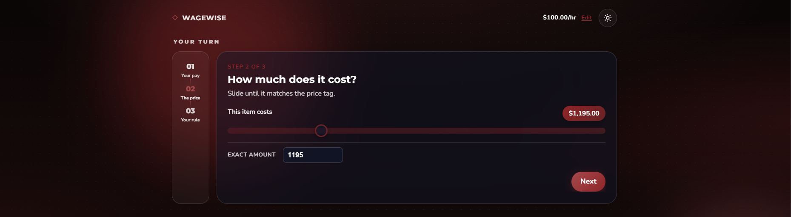

# 💸 WageWise

> Make smarter purchases by thinking in **hours, not money**

  
  
  
  
  

---

## 📸 Preview

  

---

## ✨ Overview

WageWise is a simple yet powerful web app that helps you make better financial decisions by converting prices into **hours of your life**.

Instead of asking:

> “Can I afford this?”

WageWise reframes the question to:

> **“Is this worth the time I need to work for it?”**

---

## 🧠 How It Works

| Step | Action                            |
| ---- | --------------------------------- |
| 1️⃣   | Enter your hourly wage            |
| 2️⃣   | Enter the price of an item        |
| 3️⃣   | Define your personal “price line” |
| 4️⃣   | Get an instant verdict            |

---

## 🎯 Why WageWise?

Money is abstract — time is not.

- 💡 Understand the real cost of purchases
- 🛑 Reduce impulse spending
- 🎯 Align spending with your priorities
- 🧭 Make intentional decisions

---

## 📊 Features

- ⏱️ Convert price → hours instantly
- 🎯 Personalized “worth it” threshold
- ⚡ Fast, minimal UX
- 📱 Fully responsive design

---

## 🚀 Tech Stack

| Category   | Tech            |
| ---------- | --------------- |
| Frontend   | React / Next.js |
| Language   | TypeScript      |
| Styling    | Tailwind CSS    |
| Deployment | Vercel          |

---

 
<strong>🤝 Contributing</strong>
  

Contributions, ideas, and feedback are welcome!

Open an issue
Submit a pull request

 
<strong>📄 License</strong>
  

This project is licensed under the MIT License.

 
<strong>⭐ Support</strong>
  

If you found WageWise useful, consider giving it a star ⭐ — it helps a lot!

 
<strong>🙌 Acknowledgements</strong>
  

Inspired by the idea that:

Time is the most valuable currency we have.

